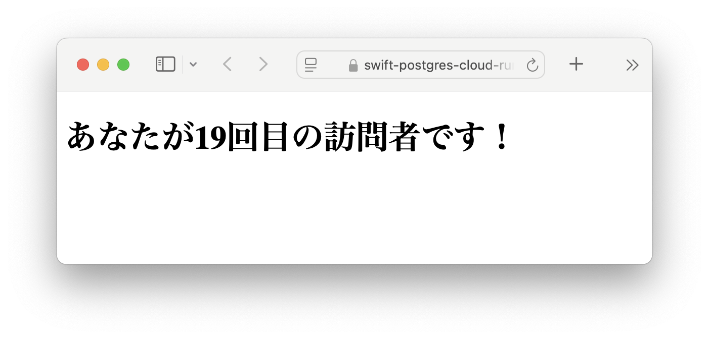

# ブログサンプルリポジトリ: 「Server-Side Swift VaporをCloud Runにデプロイし、PostgreSQLに証明書認証で接続する」

以下の記事に向けたサンプルリポジトリです

https://zenn.dev/nitnc_tanaka/articles/3a7e182ab890d4

サンプル動作環境

https://swift-postgres-cloud-run-859472539641.us-central1.run.app



## ローカルで試す方法

### 1. データベースコンテナを立ち上げる

```bash
cd db
docker compose up -d
```

### 2. マイグレーションを行い、テーブルを作成する

```bash
cd sample-vapor
swift run App migrate
```

### 3. Vaporサーバーを起動する

```bash
cd sample-vapor
swift run
```
